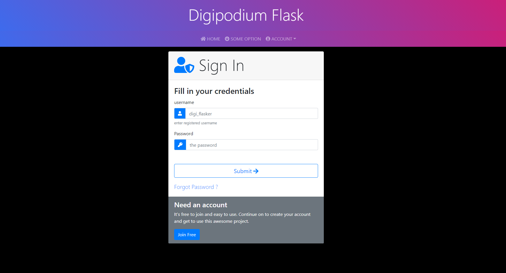
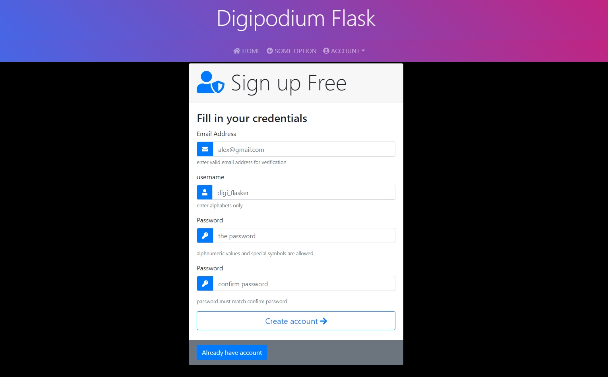
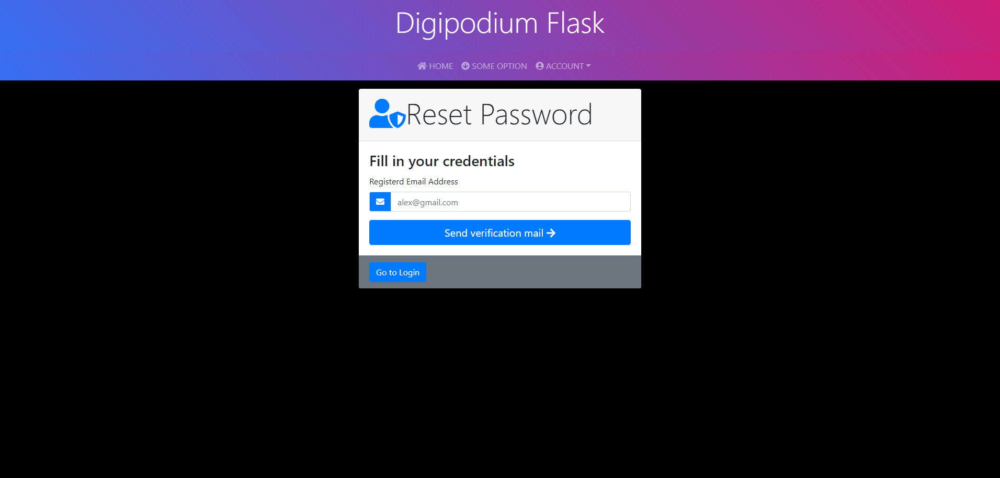
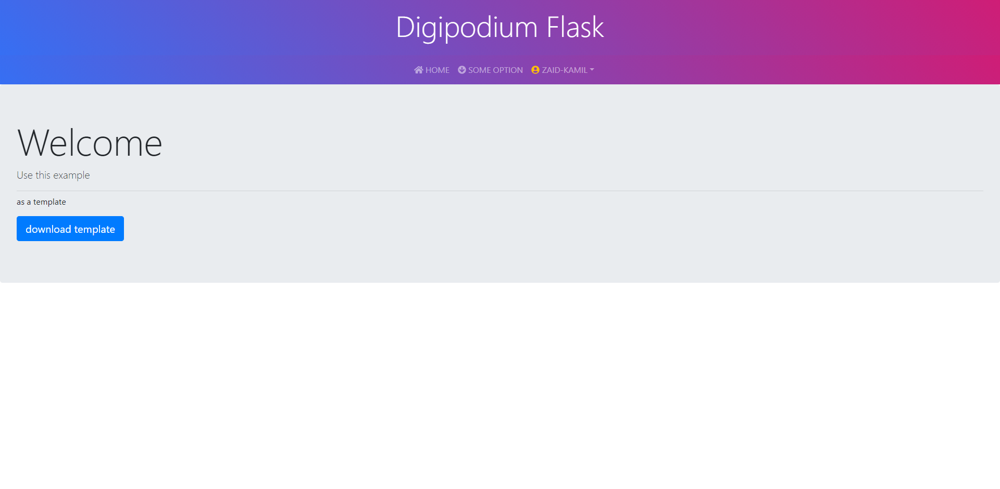

# flask_project_template
code templates demo for project on flask, containing a default login system for user to login, register and reset password

please use the requirments.txt to install dependencies

`pip install -r requirements.txt`

## to run app

`flask db migrate`

`flask db upgrade`

`flask run`

## screenshots
| | |
|:-------------------------:|:-------------------------:|
|||
|||